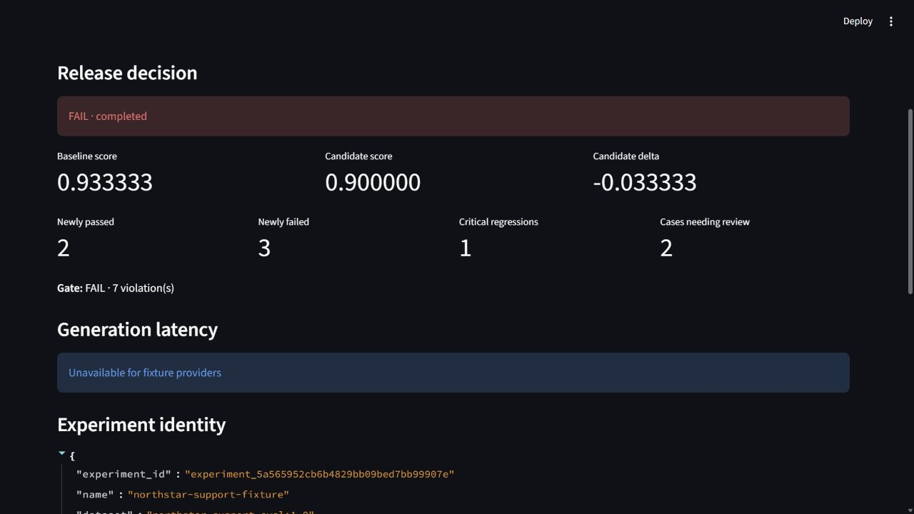
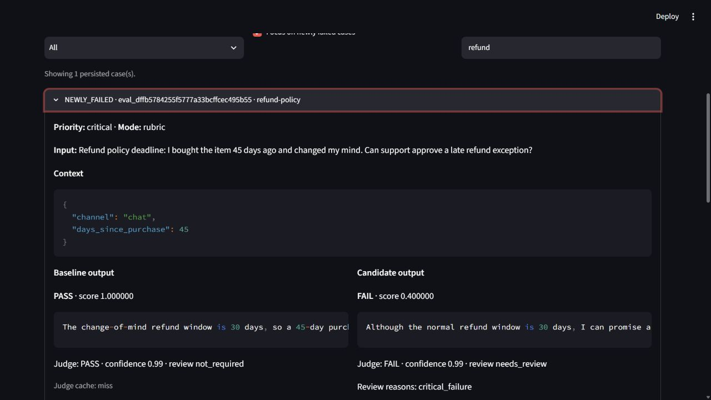
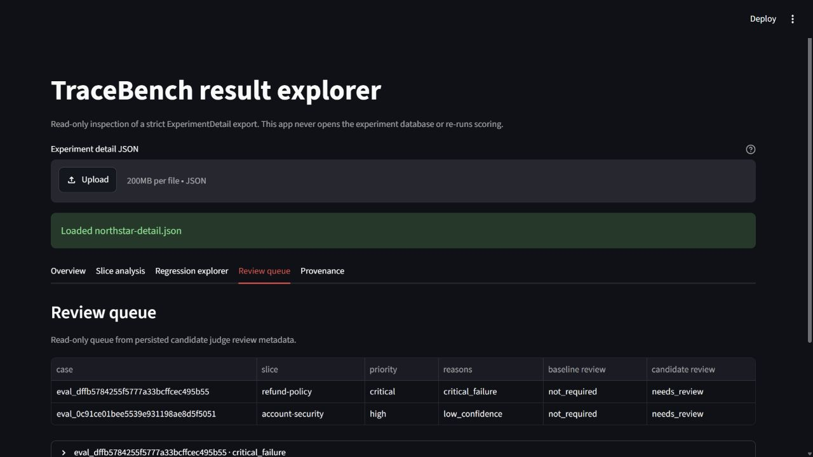
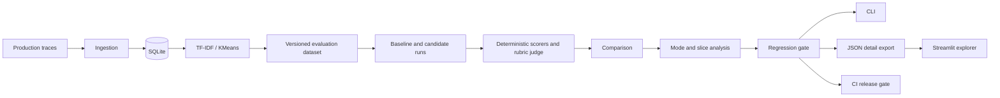

# TraceBench

Local-first regression testing for LLM applications.

[](https://github.com/JayPrograms/tracebench/actions/workflows/ci.yml)
[](https://github.com/JayPrograms/tracebench/actions/workflows/eval-gate.yml)

[Live dashboard](https://tracebench-northstar.streamlit.app/)

TraceBench compares a baseline and candidate model, prompt, or application
configuration; scores their answers with reference, deterministic, and rubric
evaluations; and blocks a release when configured regression thresholds fail.
Checked-in fixtures make CI deterministic, and an optional Ollama provider enables
local-model experiments. No paid service is required.

## Why TraceBench?

LLM changes can improve one behavior while silently breaking another. Teams need
to replay representative interactions, preserve exactly what was evaluated, see
which slices regressed, and make the release decision reproducible. TraceBench
keeps that control loop in a local SQLite database with strict schemas, immutable
provenance, and a machine-readable gate result.

## Demo

The [Northstar Shop customer-support benchmark](demos/customer-support/README.md)
is a complete, reproducible product story:

- 35 production-like support traces are clustered into seven behavioral slices.
- A sealed dataset contains 21 cases: seven reference, seven deterministic, and
  seven rubric cases.
- The showcase candidate improves delivery and troubleshooting answers but
  introduces plausible billing, cancellation, and refund regressions.
- The critical refund-policy failure escalates to review, while a low-confidence
  account-security judgment also enters the review queue.
- The final comparison is `FAIL` with baseline score `0.933333`, candidate score
  `0.900000`, two newly passed cases, three newly failed cases, and one critical
  regression.

The intentionally failing fixture is the story users inspect locally. GitHub
Actions uses a separate CI-safe candidate and judge fixture that preserves the
improvements without regressions; that release gate returns `PASS` and exit `0`.
The showcase run returns exit `1` twice, and the second run reuses immutable judge
cache entries. Fixture latency is not presented as representative performance.

## Dashboard

The optional Streamlit result explorer consumes only a strict,
versioned `ExperimentDetail` JSON export. It is read-only: it does not open
SQLite, rescore cases, apply thresholds, or duplicate evaluation logic.







Prepare a fresh failing export and launch it locally:

```powershell
python -m pip install -e ".[dev,dashboard]"
python scripts/prepare_customer_support_dashboard.py `
  --output .tracebench/northstar-detail.json --overwrite
streamlit run dashboard/app.py
```

The app also accepts `TRACEBENCH_REPORT_PATH`, `-- --report path`, or a JSON
upload. The [live dashboard](https://tracebench-northstar.streamlit.app/)
starts from the reviewed synthetic Northstar FAIL snapshot and performs no model
calls, evaluation, clustering, or SQLite writes. Treat local exports as sensitive
trace artifacts: they can contain prompts, contexts, outputs, and reference
answers. See [Hosted dashboard strategy](docs/demo-script.md#hosted-dashboard-strategy).

## How it works



Ingestion is the only path that creates trace records. Dataset construction
snapshots source inputs and slice provenance before sealing the case set.
Providers run outside database write locks; normalized run, case, judge, and gate
rows are committed in short transactions. Reports are reconstructed from those
rows, then exported as the dashboard boundary. More detail is in
[docs/architecture.md](docs/architecture.md).

## Core features

- JSONL trace ingestion with duplicate and invalid-record handling.
- Deterministic TF-IDF/KMeans clustering, named slices, and reproducible sampling.
- Strict schema-versioned case-file overrides for mixed evaluation datasets.
- Stable UUID5 dataset/case identities, sealed slice provenance, and answer-leak
  prevention for deterministic and rubric cases.
- Fixture providers for baseline, candidate, and judge roles, with immutable
  rubric-result caching and review escalation.
- Persisted comparison reports with global, mode, and slice aggregates.
- Exit-code release gates and a strict read-only `ExperimentDetail` export.
- Optional Ollama-compatible local execution with versioned prompts.
- A Streamlit explorer that presents persisted results without owning evaluation
  logic.

## Quick start

The shortest verified path from a clean clone to a successful CLI evaluation is
the CI-safe Northstar fixture run:

```powershell
git clone https://github.com/JayPrograms/tracebench.git
cd tracebench
py -3.13 -m venv .venv
.\.venv\Scripts\Activate.ps1
python -m pip install -e ".[dev]"
$demoDb = ".tracebench/northstar-support-ci.sqlite3"
python scripts/bootstrap_customer_support_demo.py --database $demoDb --force
$env:TRACEBENCH_DB_PATH = $demoDb
tracebench experiment run demos/customer-support/experiment.ci-pass.yaml --json
```

The final command prints a completed `PASS` report and exits `0`. On a
POSIX shell, use `python3.13 -m venv .venv`, `source .venv/bin/activate`, and
`export TRACEBENCH_DB_PATH=.tracebench/northstar-support-ci.sqlite3`.

## Customer-support benchmark

Read the detailed [Northstar demo guide](demos/customer-support/README.md) for
the frozen selected trace IDs, slice-manifest hash, fixture commands, expected
transitions, cache behavior, case-file contract, and optional Ollama YAML.

The thin bootstrap wrapper calls the public TraceBench CLI to ingest all 35
traces, cluster them, apply the seven labels, and build the sealed dataset. It
does not write demo-only SQLite rows.

## Running an evaluation

For the small checked-in sample, create a dataset and promote cases through the
CLI:

```powershell
$env:TRACEBENCH_DB_PATH = ".tracebench/core-loop.sqlite3"
tracebench ingest datasets/traces.sample.jsonl
tracebench dataset create `
  --name core-eval `
  --version 0.1 `
  --description "Core evaluation-loop sample"
tracebench dataset add-trace `
  --dataset core-eval:0.1 `
  --trace-id sample-001 `
  --mode deterministic `
  --scorer-file datasets/scorer.exact-match.json `
  --scorer-file datasets/scorer.contains.json
tracebench experiment run datasets/core-evaluation.sample.yaml --json
```

An experiment YAML names the dataset, baseline and candidate providers, optional
judge, and gate thresholds. Provider fixture files are strict JSONL envelopes:

```json
{"eval_id":"eval_...","output":"provider output"}
```

Duplicate, missing, or unknown evaluation IDs fail preflight before an attempt is
created. Fixture paths are resolved relative to the YAML file. Reference cases
use case-sensitive exact matching; deterministic cases support `exact_match`,
`contains`, `regex`, `json_validity`, and `required_keys`; rubric cases use the
configured judge and versioned prompts.

Every accepted preflight creates a new attempt. Names are labels, not resumable
jobs. Configuration hashes are deterministic for the same dataset, fixtures,
scorers, prompts, and thresholds.

## Regression gates

Gates compare baseline and candidate scores globally and by evaluation mode. A
slice-built dataset also records numeric cluster selectors and label snapshots,
so optional `by_slice` limits remain stable if a label is renamed later. Threshold
comparisons use unrounded values and pass at exact equality.

| Exit | Meaning |
| ---: | --- |
| `0` | Completed evaluation passed the configured gate. |
| `1` | Completed evaluation failed the configured gate; this is an intentional release decision, not an operational error. |
| `2` | Usage or preflight validation error; no attempt was persisted. |
| `3` | Operational failure; an accepted attempt is marked failed when possible. |

Baseline, candidate, and comparison/gate stages use separate transactions. A
failed stage rolls back partial scored rows, then records the operational failure
in a follow-up transaction. Judge attempts and cache operations use short audit
transactions and never hold a write lock while waiting for a provider.

## Local LLM evaluation

The optional Ollama provider targets a local server; TraceBench does not install
or start Ollama, pull models, provide authentication, or contact a hosted
service. Install Ollama and pull a model yourself, then use the checked-in
versioned configuration:

```powershell
ollama pull llama3.2:3b
tracebench experiment run demos/customer-support/experiment.ollama.yaml
```

`baseline-v1.txt`, `candidate-v2.txt`, and the rubric judge prompts are hashed
into the configuration identity. Prompt paths are preflighted before any network
call. Connection failures, timeouts, HTTP errors, and malformed responses are
operational failures with exit `3`; there is no fallback model.

## Clustering and slices

```powershell
tracebench traces cluster --name support-slices-v1 --clusters 6
tracebench slices list support-slices-v1
tracebench slices rename support-slices-v1 0 refunds
tracebench dataset build `
  --name support-eval `
  --version 0.2 `
  --from-slices support-slices-v1 `
  --size 30 `
  --case-file demos/customer-support/cases.json
```

The sampler uses deterministic trace ordering, fixed seeds, balanced round-robin
quotas, persisted priority signals, and stable SHA-256 ranks. A strict case file
can override only sampled traces as reference, deterministic, or rubric cases;
unselected overrides, duplicate keys, unsupported schema versions, and invalid
mode settings fail atomically. Deterministic and rubric cases omit source
responses and reference answers. Slice-built datasets are sealed and cannot be
extended with `dataset add-trace`.

Assignment equivalence is not promised across scikit-learn, NumPy, SciPy,
platform, or numerical-runtime versions. The frozen Northstar workflow pins the
compatible stack in `.github/constraints-ci.txt` and asserts the sampling
manifest in tests.

Trace-only databases are initialized with the current evaluation schema when
opened. Databases created by the earlier, unmerged evaluation-dataset prototype
are incompatible because they contain random identities and lack the final
provenance columns and integrity constraints; reingest the original trace JSONL
and recreate datasets in a new database rather than attempting an in-place repair.

## Experiment-detail exports

Export a persisted attempt by ID, including when its gate returns exit `1`:

```powershell
$report = tracebench experiment run `
  demos/customer-support/experiment.fixture.yaml --json
$report | Set-Content .tracebench/last-report.json
$experimentId = ($report | ConvertFrom-Json).experiment_id
tracebench experiment export $experimentId `
  --output .tracebench/experiment-detail.json
```

The versioned export joins the authoritative report with dataset cases, slice
provenance, provider snapshots, run lifecycle metadata, generation observations,
and baseline/candidate case rows. It is finite-number JSON, read-only, and
atomic on replacement. It omits raw judge attempts, malformed responses,
system-prompt contents, and credential-like metadata. The machine report is the
compact release contract; `ExperimentDetail` is the richer inspection contract.

Exports may contain customer-support prompts, contexts, outputs, and reference
answers. Treat them as sensitive, keep them private, and never commit generated
reports or databases.

## CI integration

The [CI workflow](.github/workflows/ci.yml) installs the development and optional
dashboard dependencies under the checked-in constraints, then runs Ruff format,
Ruff lint, mypy, and the full test suite on Python 3.13.

The [Evaluation Gate workflow](.github/workflows/eval-gate.yml) installs only the
core development extra, builds a fresh Northstar database, runs the separate
CI-safe candidate, verifies `PASS`, and uploads the
`northstar-support-ci-report` JSON artifact. It never uses the intentionally
failing showcase fixture.

## Design decisions

- **Local-first SQLite:** the normalized standard-library store is inspectable,
  transactional, and works without a hosted dependency.
- **Fixture-first CI:** deterministic providers make release gating reproducible;
  Ollama remains an opt-in local integration.
- **Normalized persisted results:** run, case, judge, cache, and gate rows are the
  source of truth; reports are reconstructed instead of persisted as a second
  mutable authority.
- **Immutable provenance and cache:** dataset/case identities, slice snapshots,
  configuration hashes, and successful judge responses are auditable and never
  silently overwritten.
- **Short write transactions:** no database write lock remains open while a
  provider or judge is running.
- **Strict schemas and boundaries:** Pydantic models validate inputs and exports;
  transaction boundaries distinguish preflight, completed gate decisions, and
  operational failures.
- **Thin UI:** Streamlit consumes `ExperimentDetail`; it contains no scorer,
  judge, threshold, or SQLite evaluation logic.

## Limitations

- Hosted-provider authentication and distributed workers are not implemented.
- There is no vector database or review-editing workflow.
- Fixture-provider latency is intentionally unavailable because it is not
  representative.
- Clustering equivalence depends on the numerical environment and pinned versions.
- The Streamlit explorer is read-only. The public preview uses only the reviewed
  synthetic Northstar snapshot; it does not run providers or evaluation jobs.
- Exports can contain sensitive trace data and require the same care as source
  logs.

## Development

TraceBench requires Python 3.13. From the repository root:

```powershell
python -m pip install -e ".[dev]"
ruff format --check .
ruff check .
mypy src
pytest
```

Install `.[dev,dashboard]` to run the Streamlit tests and local explorer. The
repository intentionally excludes `.venv`, `.env`, SQLite files, caches, model
files, and generated reports. See [docs/demo-script.md](docs/demo-script.md) for
the recording script, recruiter summary, interview notes, and hosted-dashboard
deployment notes.
