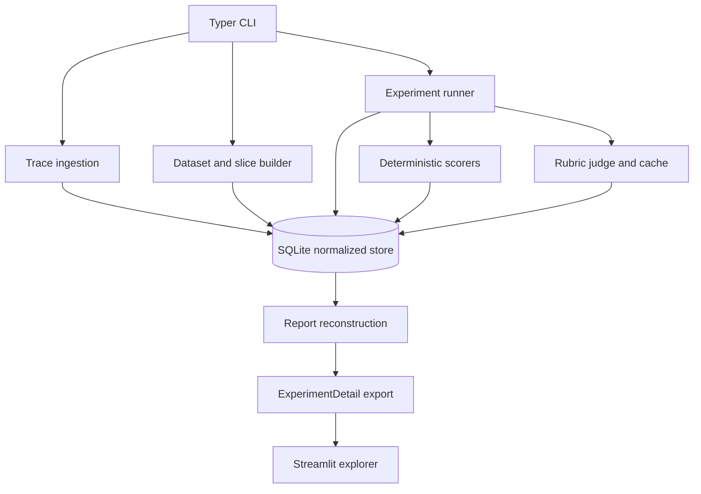

# TraceBench architecture

TraceBench is deliberately a local pipeline rather than a hosted control plane.
The CLI and persistence layer are authoritative; providers are replaceable
inputs to an experiment, and the dashboard is a read-only consumer of an export.

## Component boundaries

`src/tracebench/cli.py` validates command input and delegates to domain
operations. `storage.py` owns schema creation, migrations, and connection
configuration. `datasets.py` owns eligibility, deterministic sampling, case-file
validation, sealing, and provenance. Experiment orchestration owns provider
preflight, run lifecycle, scoring, comparison, gates, and judge review state.
`reporting.py` reconstructs the persisted report and detail document; it does not
create a second mutable evaluation authority. `dashboard.py` and
`dashboard/app.py` select and present values already present in `ExperimentDetail`.

## Authoritative data flow

1. **Ingest.** Each valid JSONL trace is validated and inserted once by
   `trace_id`; invalid records and duplicates are reported without partially
   accepting a malformed record.
2. **Cluster.** A clustering run snapshots the ordered trace source manifest,
   vectorization settings, numerical dependency identity, labels, and assignments.
   Later label edits change metadata only; the numeric selector remains stable.
3. **Build.** Dataset construction samples only assigned, eligible traces. A
   schema-versioned case file may override sampled traces as reference,
   deterministic, or rubric cases. The builder snapshots source fields, slice
   provenance, priority signals, and sampling identity, then seals a slice-built
   dataset. Deterministic and rubric cases intentionally omit source responses and
   reference answers.
4. **Preflight.** Experiment YAML, provider files, scorer definitions, judge
   prompts, and gate selectors are validated before an accepted attempt exists.
5. **Run.** Baseline and candidate providers generate outside SQLite write locks.
   Their outputs, scorer results, generation observations, and provider metadata
   are committed under the run role. Rubric judge attempts are independently
   audited and successful responses enter an immutable cache.
6. **Compare.** Normalized rows are aggregated globally, by mode, and (for
   slice-built datasets) by numeric slice selector. The gate records every
   violation and derives the completed `PASS` or `FAIL` verdict.
7. **Inspect.** Human-readable output and compact `--json` output are reconstructed
   from the same rows. `experiment export` joins the report to cases, provenance,
   runs, provider snapshots, and generation observations as strict versioned JSON.
   The Streamlit app reads only this file.

## Persistence and integrity

The database contains normalized trace, clustering, dataset, case, experiment,
run, result, judge, cache, and audit tables. Foreign keys and uniqueness
constraints protect identity and relationship invariants. Dataset and evaluation
case IDs are UUID5 values derived from logical names and source trace IDs, so
rebuilding the same logical definition reproduces identities without Python's
process-randomized `hash()`.

Writes that replace a detail export use a temporary file, flush and `fsync`, and
`os.replace`; non-overwrite export is exclusive and never destroys an existing
file. Generated databases and reports remain ignored and are not release assets.

## Transactions and failures

- Preflight validation has no persisted attempt and returns exit `2`.
- Baseline scoring, candidate scoring, and comparison/gate persistence use
  separate short transactions. A failed stage rolls back its partial rows.
- After rollback, a follow-up transaction records the accepted attempt as
  operationally `failed` with a failure stage/message where possible; this returns
  exit `3` and never invents a verdict.
- A completed gate decision has status `completed`, verdict `PASS` or `FAIL`, and
  exit `0` or `1` respectively.
- Judge raw attempts are audit records. Malformed responses may be retried once
  with the versioned retry prompt, but malformed or failed responses are never
  cached. Cache lookups/inserts are short transactions and do not hold a write
  lock while waiting for a provider.

The separation means an operational failure cannot be mistaken for a quality
regression, while a quality regression remains a first-class, reproducible release
decision.

## Report boundary

`ExperimentReport` is the compact automation contract used by the CLI and CI.
`ExperimentDetail` is the inspection contract used by the dashboard. The detail
export deliberately excludes raw judge attempts, malformed responses,
system-prompt contents, and credential-like metadata, but it can still contain
customer prompts, contexts, outputs, and reference answers. Treat it as sensitive
trace data. See the [demo recording package](demo-script.md) for the hosted
delivery notes. The public dashboard is a read-only synthetic preview; it is
not a hosted evaluation service.
